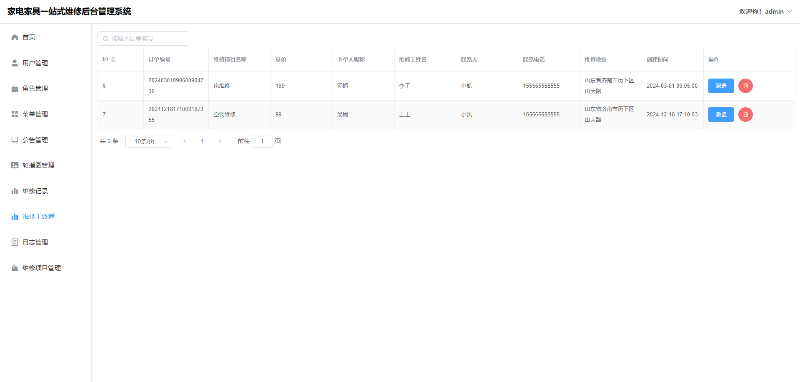
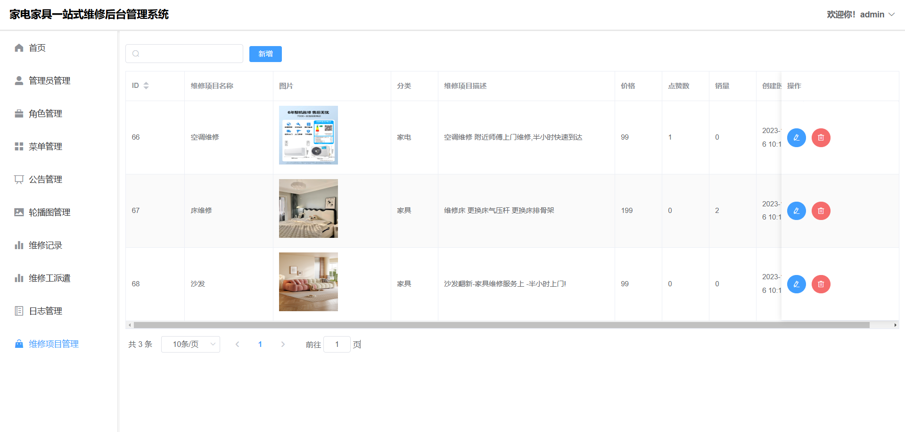

# 基于Java+SpringBoot+Vue家具家电维修系统(源码+数据库)

#### 作者QQ：3275035005 微信：xkbishe123 (支持修改、 部署调试、 代做接毕业设计和课程设计)

#### 网站建设、小程序、H5、APP、各种系统、样式修改、10000套源码可选。

#### 选题+开题报告+任务书+程序定制+安装调试+论文+答辩ppt 都可以做

#### 问题包修改，包满意，有需求尽管甩过来！一条龙帮你安心过！

#### 所有项目以及源代码本人均调试运行无问题 可支持远程调试运行

# 项目介绍
基于Java+SpringBoot+Vue家具家电维修系统-毕业设计，本系统分为用户、管理员、维修工项目采用前后端分离开发。

可选题目：家具家电维修系统、家具家电维修管理系统、家具家电一站式维修系统

### 1. 用户

登录、注册、找回密码、查看轮播图、查看维修项目、搜索维修项目、维修预约、维修评价、我的订单、查看收藏维修项目、维修地址管理、个人信息修改、个人信息充值、退出登录

### 2. 管理员

登录、找回密码、首页项目分类维修统计、首页公告通知、用户管理、角色管理、菜单管理、公告管理、日志管理、轮播图管理、维修记录管理、维修工派遣管理、维修项目管理、退出登录

### 3. 维修工

登录、查看我的订单、上报维修完成、找回密码、个人信息修改、退出登录

# 技术框架
- 开发语言：Java
- 数据库：Mysql5.7以上
- 系统环境：jdk8、maven、node
- 后端框架：SpringBoot、MyBatis
- 前端框架：Vue、ElementUI
- 工具：IDEA、Navicat
- 技术架构：前后端分离、B/S架构、MVC架构
# 项目截图

### 1. 学生端

### 2. 管理员端

### 3. 维修工端

